Сайт с подобием NFT + админка. (Python и Flask).
Перед первым запуском необходимо установить необходимые пакеты:

pip install -r requirements.txt

Программа запускается скриптом main.py

После запуска реклама выводит ссылку на страницу: http://127.0.0.1:5000 после перехода на неё, открывается главная
страница сайта:

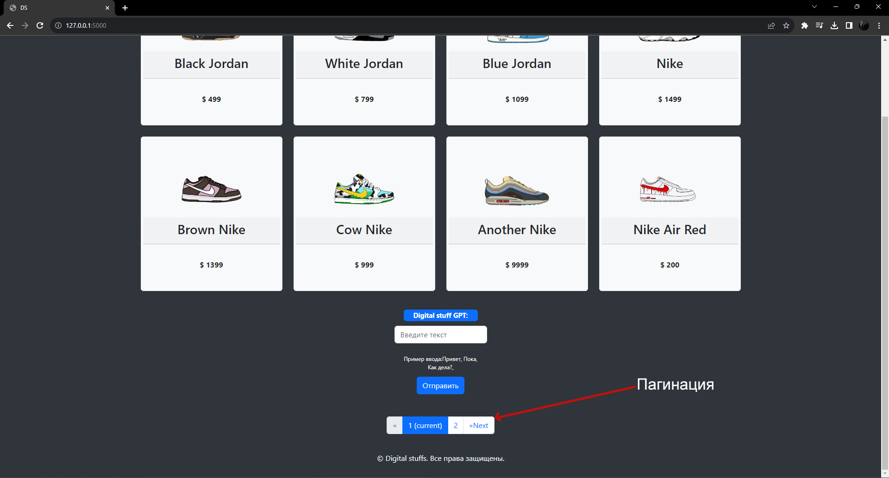

Для вывода предметов и авторизации пользователей используется база данных состоящая из трёх таблиц:

1. Image - Таблица со всеми загруженными предметами:

* Номер (id);
* Название (name);
* Цена(price);
* Путь к файлу(path)

2. User - Таблица с пользователями сайта:
* Номер (id);
* Имя (name);
* Почта (email);
* Пароль (hashed_password)
3. Zip - Таблица с загруженными архивами
* Номер (id);
* Имя файла (name);
* Путь к архиву (path)

Для авторизации необходимо нажать кнопки "Авторизация" и затем "Войти"

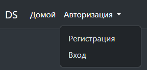

Откроется форма авторизации:

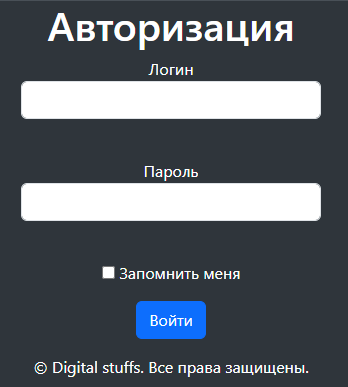

Для ознакомления можно ввести:

Логин: email2@mail.ru 
Пароль: 123456

После входа, кнопки навбара поменяются:

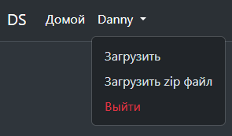

После того как пользователь зашел, у каждой карточки появится кнопка "Скачать":

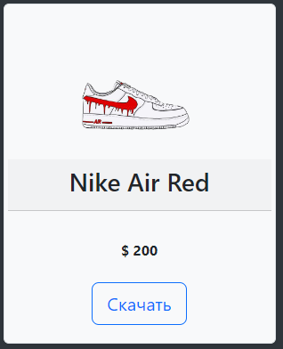

Если пользователь впервые на сайте, он может зарегистрироваться:

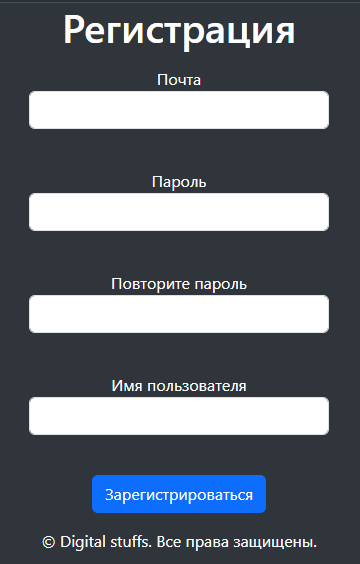

После регистрации, данные пользователя попадут в базу данных и он в любой момент сможет зайти под своими данными.

После входа, появляется возможность загрузить файл на сайт, после чего он отобразится на странице.
Это можно сделать с помощью кнопки "Загрузить", после чего откроется форма:

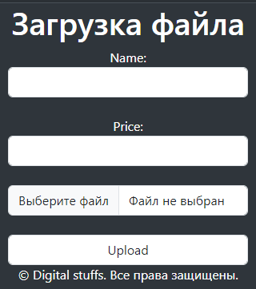

Так же, имеется возможность загрузить zip файл с помощью кнопки "Загрузить zip файл":

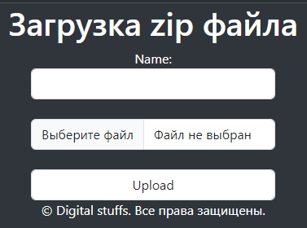

<h3> Панель администратора</h3>

Переход на страницу осуществляется с помощью ввода ссылки: http://127.0.0.1:5000/admin

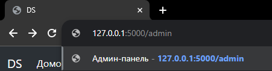

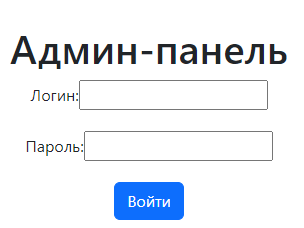

Тестовые данные для входа:

Логин: admin 
Пароль: 12345

После входа, откроется главная страница:

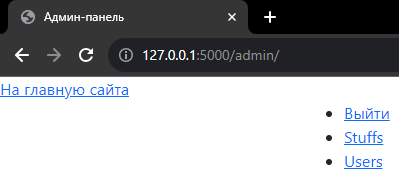

С помощью панели админа можно редактировать предметы на сайте и пользователей
Страница редактирования предметов:

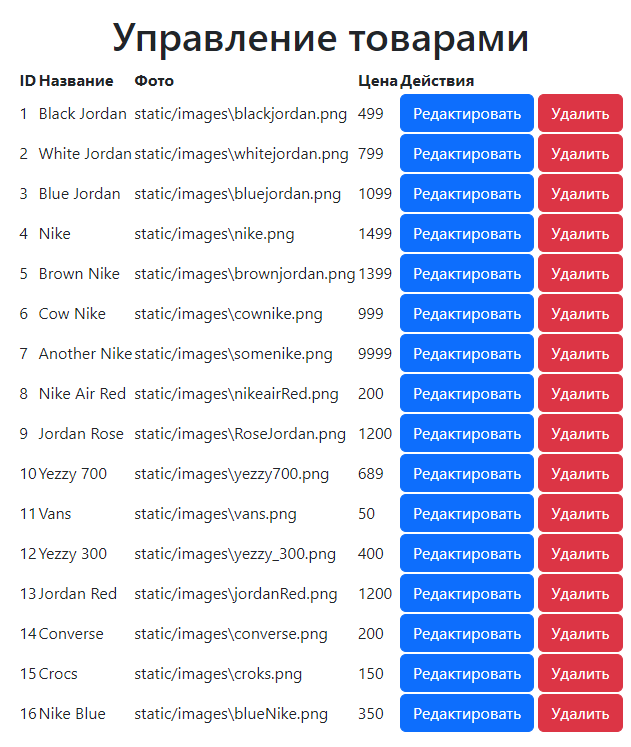

Форма редактирования предмета:

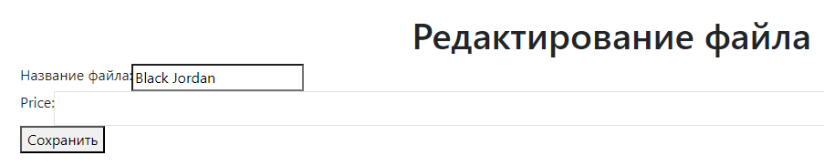

Страница редактирования пользователей:

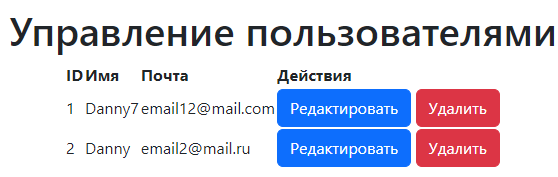

Форма редактирования пользователя:

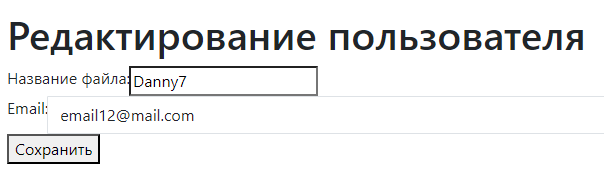

